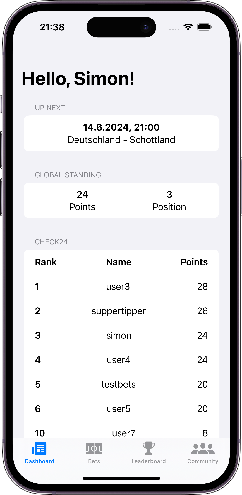
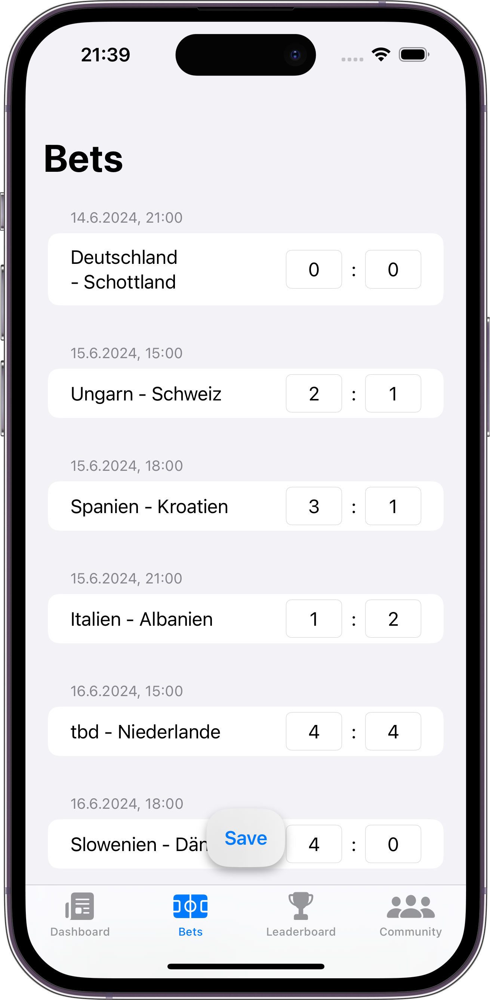
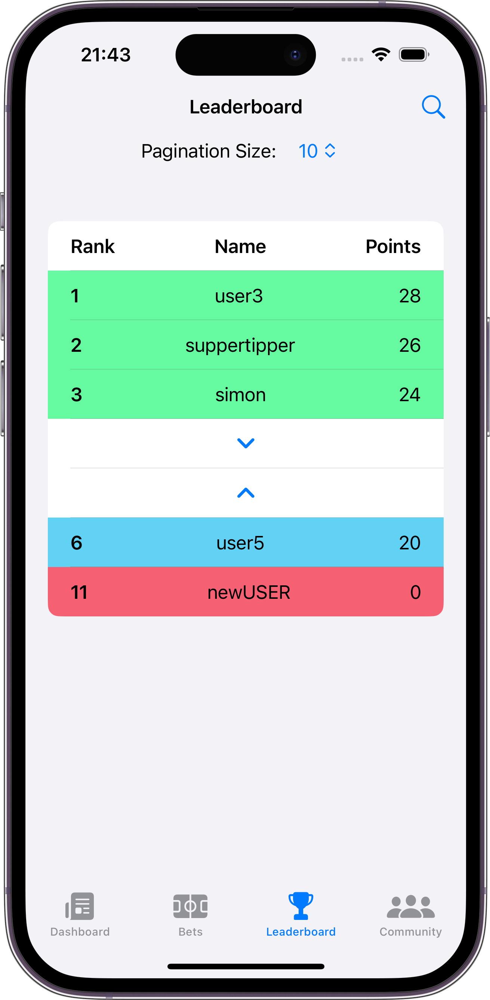
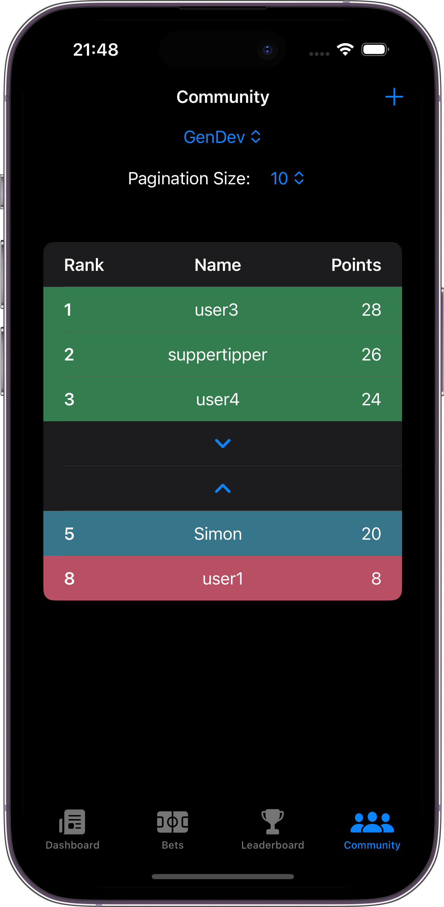
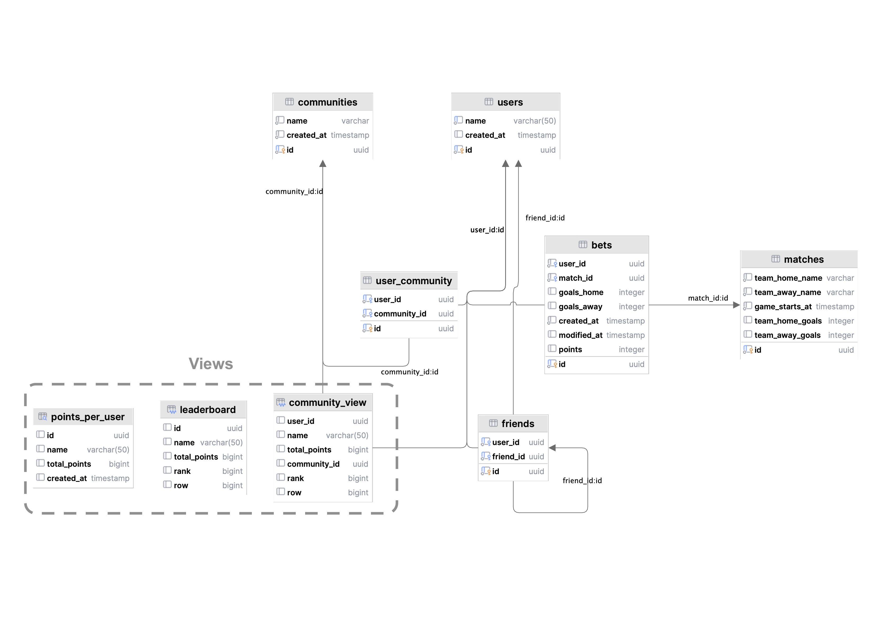

# Euro 2024 Betting Game

> This project is part of the [Check 24 Challenge](https://github.com/check24-scholarships/check24-betting-challenge). It is a coding challenge aimed at building a fully functional application that enables a betting game for Euro 2024.

## Table of Contents

1. [Introduction]()
2. [Features](#features)
3. [Architecture](#architecture)
4. [Frontend (iOS)](#frontend-ios)
    - [Screenshots](#screenshots)
    - [Dashboard](#dashboard)
    - [Bets](#bets)
    - [Leaderboard](#leaderboard)
    - [Communities](#communities)
5. [Backend (Vapor)](#backend-vapor)
    - [Admin Area](#admin-area)
6. [Database](#database)
    - [Schema](#schema)
    - [Features](#features-1)
    - [Sample Function: Query for Points Calculation](#sample-function-query-for-points-calculation)
7. [Installation](#installation)
8. [License](#license)


## Features

- [x] Registration and login
- [x] Place bets
- [x] Points allocation
- [x] Leaderboard (Global and Communities)
- [x] Admin area
- [x] Dashboard

## Architecture

The application is based on the following core technologies:

- Frontend: Native iOS (with SwiftUI)
- Backend: Vapor (Swift Backend Framework)
- Database: PostgreSQL

It uses a classic client-server architecture, where the client (iOS app) communicates with the server (Vapor). Data is stored in a PostgreSQL database.

## Frontend (iOS)

#### Screenshots




<br clear="left"/>
<br/>

_(The app supports Dark Mode for all views)_

#### Dashboard
The dashboard shows the next game and a preview of the leaderboards. Both the global leaderboard and the leaderboard for communities that the user is a member of are displayed.

#### Bets

In the Bets view, users can place their bets. A list of all games is displayed, and users can enter and save their predictions.

#### Leaderboard

The global leaderboard is displayed. Users can navigate from the top 3 downwards and from their position upwards. Pagination can be selected to define how many additional entries are loaded when navigating up or down.
Friends (pinned users) are directly integrated into the list. By clicking on a row, a person can be added as a friend.
The following colors are used:
- Green: Top 3
- Blue: User
- Yellow: Friends
- Red: Last place
- White: Other users

#### Communities

Here, users can create new communities or join existing ones. A constraint in the database ensures that a user can join a maximum of 5 communities.

## Backend (Vapor)

The backend provides a REST API.
Since the game logic (points calculation, leaderboard creation, constraints) is implemented in the database, the backend is quite simple.

### Admin Area

The only exception is the administrator area. The administrator view is kept very simple and is provided directly by the server as a single-page application. The admin can enter a new result for any game at any time. Once "Submit" is pressed, the new result is saved in the database, and the points and new leaderboards are calculated in the database. The admin area can be accessed via `localhost:8080/admin`.

## Database

### Schema



### Features

As one of the requirements was that the application remains performant with a high number of users, the essential game logic was implemented in the database. This means that points allocation and the leaderboard are calculated in the database. This allows efficient calculation thanks to set-based operations. Points are automatically recalculated when the admin enters a game result, and the points for the bets and the leaderboard are updated. This is stored in a materialized view, so the calculation is only performed once, and the data is read for each retrieval.

### Sample Function: Query for Points Calculation

```SQL
create procedure updatepointsbets(IN for_match_id uuid)
    language sql
BEGIN ATOMIC
UPDATE bets b
SET points = CASE WHEN -- Correct result
    m.team_away_goals = b.goals_away AND m.team_home_goals = b.goals_home
    THEN 8
    WHEN -- Correct goal difference
        (m.team_away_goals - m.team_home_goals) = (b.goals_away - b.goals_home) AND
        b.goals_home != b.goals_away -- No draw
    THEN 6
    WHEN -- Correct winner
        (m.team_away_goals - m.team_home_goals) >= 0 AND (b.goals_away - b.goals_home) >= 0 OR
        (m.team_away_goals - m.team_home_goals) <= 0 AND (b.goals_away - b.goals_home) <= 0
    THEN 4
    ELSE 0 -- Wrong result
END
FROM matches m, users u
   WHERE ((m.id = b.match_id) AND (u.id = b.user_id) AND (m.id = updatepointsbets.for_match_id));
END;
```

Other functions used can be found in `db/init.sql` or by connecting to the database using any tool like DataGrip or pgAdmin.

## Installation

The entire project is containerized, allowing you to run the whole project with a single command. You need Docker installed on your machine. The server runs on port 8080 and the database on port 5432. The backend can also be hosted on a Linux server.

1. Clone the repository
2. Run `docker-compose up` in the root directory
3. Open the iOS project in Xcode and start the app

(If you want to test the app on your device, you need to change the IP address in the `Settings.swift` file to your local IP address; otherwise, you can only test the app in the simulator).

The database is initialized based on the `init.sql` file. This sets up the schema and loads sample data so you can start immediately. If this data is not needed, simply adjust the initialization file and delete the COPY statements. Random results for the games are already entered, so you can see an example result.


## License
This project is licensed under the MIT License.

See [License](LICENSE) for more information.
